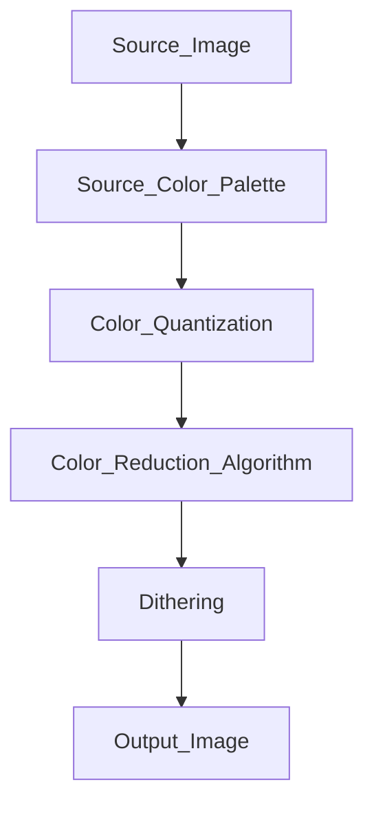

# ColourClashNet
A basic collection of classes to handle image color reduction.

## Purposes
These tools can be used to create displayable images for old computer video modes, using various color reduction algorithms, color quantization, and dithering.

## Reduction recipe
To reduce colors on source images for old computers' video mode we need to know:
- The output computer color space, aka the number of bits the system uses to represent a color. 
Source image usually has 3 color channels (Red, Green, and blue) with 8-bit for color, for a total of 16 million selectable colors.
Old computers usually have 3 channels with  3 or 4-bit for color, for a total of 512 or 4096 selectable colors, or even a fixed color palette.
- The maximum number of colors displayable on video modes. Most computers can display only 16 colors on screen.
- The hardware limitations. Most computers use tricks to minimize ram consumption, like using tiles or doubling pixels techniques. 

## How to
Simply create a ColorTransform class, select color quantization, the maximum number of colors, and a dithering algorithm.
Feed it with an input image and get the transformed image.

### Processing

## Limitations
Processing algorithms don't support alpha channels.

## To do
A lot of stuff, like sprite masking and assembly code generation. 

## Support
### Quantization
