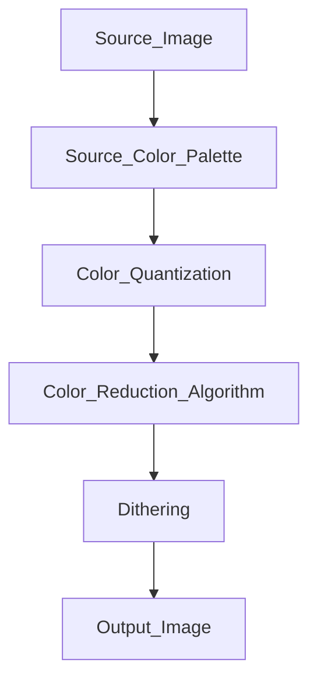

# ColourClashNet
A basic collection of classes to handle image color reduction.

## Purposes
These tools can be used to create displayable images for old computer video modes, using various color reduction algorithms, color quantization, and dithering.

## Reduction recipe
To reduce colors on source images for old computers' video mode we need to know:
- The output computer color space, aka the number of bits the system uses to represent a color. 
Source image usually has 3 color channels (red, green, and blue) with 8-bit channel, for a total of 16 million selectable colors.
Old computers usually have 3 channels with  3 or 4-bit for color, for a total of 512 or 4096 selectable colors, or even a fixed color palette.
- The maximum number of colors displayable on video modes. Most computers can display only 16 colors on screen.
- The hardware limitations. Most computers use tricks to minimize ram consumption, like using tiles or doubling pixels techniques. 

## How to
Simply create a ColorTransform class, select color quantization, the maximum number of colors, and a dithering algorithm.
Feed it with an input image and get the transformed image.

### Processing

## Limitations
Processing algorithms don't support alpha channels.

## To do
A lot of stuff, like sprite masking and assembly code generation. 

## Support
### Quantization
Quantization reduces the number of bits for colors channel. The lower value, the less shadow of colors.
|Quantization Level|Red Shades|Green Shades|Blue Shades|Total selectable colors| Notes |
|-:|-|-|-|-|-|
| 8-8-8 | 256 | 256 | 256 | 16,777,216 | 24 bit images, SVGA, Amiga AGA |
| 6-6-6 | 64  | 64  | 64  | 262,144 | Amiga HAM8 |
| 5-6-5 | 32 | 64 | 32 | 65536 | Hi Color, SNES, VGA |
| 5-5-5 | 32 | 32 | 32 | 32768 | Hi Color |
| 4-4-4 | 16 | 16 | 16 | 4096 | Amiga OCS/ECS, Atari STE, NeoGeo |
| 3-3-3 | 8 | 8 | 8 |  512 | Atari ST, Genesis, PC Engine |
| 2-2-2 | 4 | 4 | 4 |  64 | EGA |
| 1-1-1 | 2 | 2 | 2 |  8  | Basic Color Schemes |

| Original Image (22000 colors) | 5-6-5 Quantization | 4-4-4 Quantization | 3-3-3 Quandtization | 1-1-1 Quantization |
|-:|-|-|-|-|
||||||

### Dithering
Dithering spreads the color reduction approximation errors over the entire image. It generates artifacts that simulate 

| 16 Color Image Without Dithering | 2x2 Ordered Dithering | 4x4 Ordered Dithering | Floyd Steimberg Dithering | Jarvis, Judice and Ninke Dithering |
|-:|-|-|-|-|
||||||

